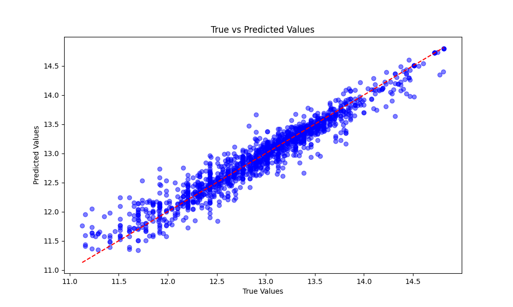

# Car Price Prediction and Recommendation System

## Project Description
This project is a machine learning-based car price prediction system. It uses a cleaned and optimized dataset to train a regression model for predicting car prices based on user input. Additionally, the system provides recommendations for similar cars from the dataset. The project includes features such as dataset preprocessing, hyperparameter optimization, and a web interface for user interaction.

## Dataset
Dataset **Cardekho** used in this project. You can access from <a href='https://www.kaggle.com/datasets/manishkr1754/cardekho-used-car-data'>Kaggle</a>

## Workflow
### Dataset Cleaning
1. **Removing Null Values**: Missing values are handled by dropping incomplete rows or filling them with appropriate values.
2. **Feature Engineering**:
   - Created new features like `car_age` from the `year` column.
   - Applied one-hot encoding for categorical columns such as `fuel`, `transmission`, `seller_type`, and `brand`.
3. **Scaling and Normalization**:
   - Used `MinMaxScaler` for numerical features like `mileage(km/ltr/kg)` and `engine`.
4. **Outlier Removal**:
   - Implemented the IQR method to remove extreme values in the `selling_price` column.

### Dataset Optimization
- Applied TF-IDF vectorization to extract important features from car model names.
- Removed redundant columns for improved model training performance.

## Model Training
### Algorithm
- Trained a **Random Forest Regressor** on the dataset for price prediction.

### Hyperparameter Optimization
- Conducted a grid search using `GridSearchCV` with parameters like:
  - `n_estimators`
  - `max_depth`
  - `min_samples_split`
  - `min_samples_leaf`

### Metrics
- Evaluated the model using the following metrics:
  - Mean Absolute Error (MAE)
  - Mean Squared Error (MSE)
  - R² Score
  - Explained Variance

### Results
- **Best Parameters**: Selected based on cross-validation R² scores.
- Feature importance was visualized to understand the contribution of each feature.


## Visualizations

### Feature Importance
A bar chart visualizing the importance of features in predicting car prices.


### Actual vs Predicted Values
Scatter plot showing the relationship between actual and predicted prices.



### Learning Curve
A learning curve was plotted to show the model's performance on the training and validation sets. It highlights the relationship between the number of training samples and model accuracy.


### Error Distribution
Histogram depicting the distribution of prediction errors.


## Web Interface
- The project includes a Flask-based web interface.
- Users can input car details to get:
  1. Predicted price for their car.
  2. Recommendations for similar cars.

## Suggestion System
- A suggestion system identifies the top 5 most similar cars based on:
  - Euclidean distances between user input and dataset features.
- Provides additional insights by comparing predicted prices with actual dataset prices.

## Future Improvements
- Incorporate additional features like car condition and regional pricing variations.
- Enhance the recommendation algorithm with advanced similarity metrics.
- Transition to a cloud-based architecture for real-time predictions.


## Installation

To run this project locally, follow these steps:

1. **Clone the Repository**:
   ```bash
   git clone https://github.com/yourusername/car-price-prediction.git
   cd car-price-prediction
   ```

2. **Install Required Dependencies**:
   ```bash
   pip install -r requirements.txt
   ```

3. **Prepare the Dataset**:
   - Place the dataset file (`cardekho.csv`) in the root directory.

4. **Train the Model**:
   ```bash
   python train_model.py
   ```

5. **Run the Web Application**:
   ```bash
   python web.py
   ```
   Access the application at `http://127.0.0.1:5000/`.


## Contributing

Contributions are welcome! To contribute:

1. **Fork the Repository**.
2. **Create a Feature Branch**:
   ```bash
   git checkout -b feature-name
   ```
3. **Commit Your Changes**:
   ```bash
   git commit -m "Describe your feature"
   ```
4. **Push to Your Fork**:
   ```bash
   git push origin feature-name
   ```
5. **Open a Pull Request**.


